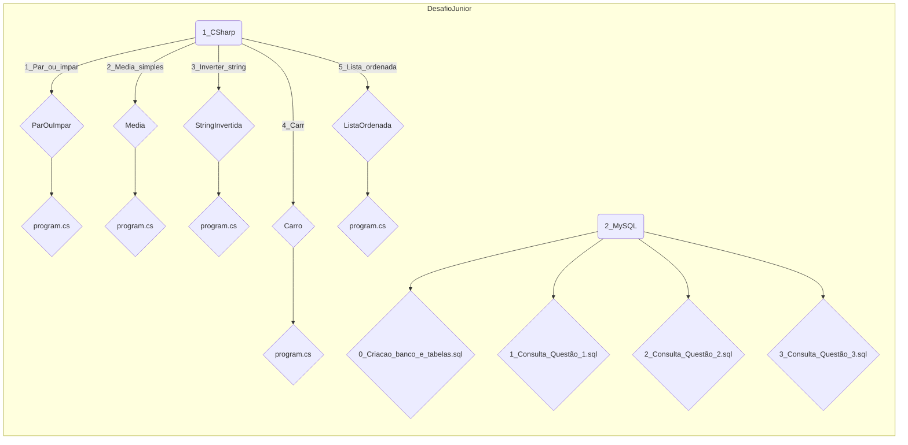

# DESAFIO JUNIOR

##### DANILO HOLANDA ARAUJO                                                                                                          05/11/2024

##### danilo.h.araujo@gmail.com                                                                                              [Daniloha/Desafio_Junior](https://github.com/Daniloha/Desafio_Junior)

---

### **Modelo de Avaliação Prática para Desenvolvedores Júnior**

Este modelo de avaliação foi projetado para avaliar de forma prática as habilidades de programação de candidatos a posições júnior ou estágio. Através de um conjunto de exercícios práticos, o candidato demonstra seu conhecimento em:

* **Lógica de programação:** Resolução de problemas algorítmicos e tomada de decisões.
* **Linguagem de programação:** Domínio da sintaxe e estruturas de dados da linguagem escolhida (C# neste exemplo).
* **Orientação a objetos:** Criação e utilização de classes e objetos.
* **Bancos de dados relacionais:** Escrita de consultas SQL para manipulação de dados.

Os exercícios abrangem desde problemas básicos de manipulação de dados até a criação de classes e a realização de consultas complexas em um banco de dados relacional, simulando desafios comuns em um ambiente de desenvolvimento.

###### **Conteúdo da avaliação:**

* **Exercícios de programação:** Codificação de algoritmos para resolver problemas específicos.
* **Criação de classes:** Modelagem de objetos e seus comportamentos.
* **Consultas SQL:** Manipulação de dados em um banco de dados relacional.

###### **Linguagens:** C#, SQL

###### **Duração máxima:** 3 dias

###### Estrutura de pastas:

